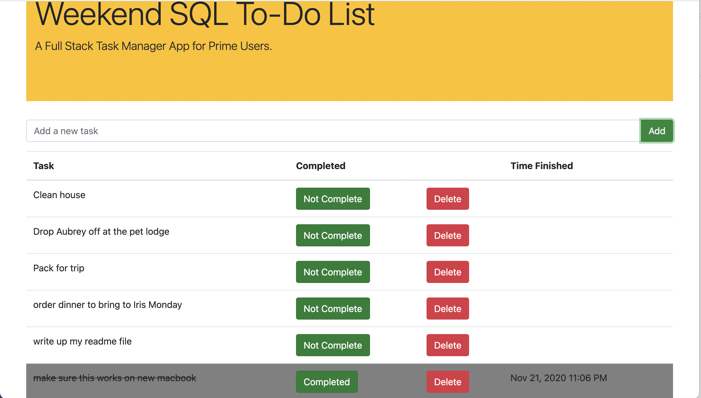

# Weekend SQL Task List

## Description
Duration: Weekend - 12 hours

This full stack application allows the user to create tasks, mark them as completed and delete finished tasks. When tasks are marked as complete, the time the complete button was clicked logs the time so the user can see when the task was finished. When the user selects to delete a task, a smart alert will pop up to confirm that the user truly wishes to delete the task from the list.

## Screen Shots

The application in action

## Installation

### Required

#### npm Dependencies
- Express
- Node
- SweetAlert
- Moment

#### SQL Reuirments
- Postgre SQL

1. Install the required dependencies using npm.
2. Create a postgre SQL database named "weekend-to-do-app" using an app like Postico
3. Run the table creation SQL query from the database.sql file within the application files
3. Run npm start from comman line
4. Open localhost:5000

## Built With

- HTML
- CSS
- Jquery
- Node
- Express
- PostGres SQL
- Bootstrap

## License
[MIT](https://choosealicense.com/licenses/mit/)

## Acknowledgement
Thanks to [Prime Digital Academy](www.primeacademy.io) who equipped and helped me to make this application a reality. 

Special thanks to my learnign group for this week from my Vatti Cohort:
- [Carl Barfuss](https://github.com/carlbarfuss)
- [Jim Bird](https://github.com/jbird55044)
- [Malik Elate](https://github.com/MalikElate)

Extra Thanks to Late Night and Early Morning Work Consultations from:
- [Josie Fredericksen](https://github.com/freder48)
- [Kimberly Orchard](https://github.com/korchard)

And last but never least, my Prime primary instructor:
-[Mary Mosman]

## Support
If you have suggestions or issues, please email me at [steven.maloney@gmail.com](mailto:steven.maloney@gmail.com)